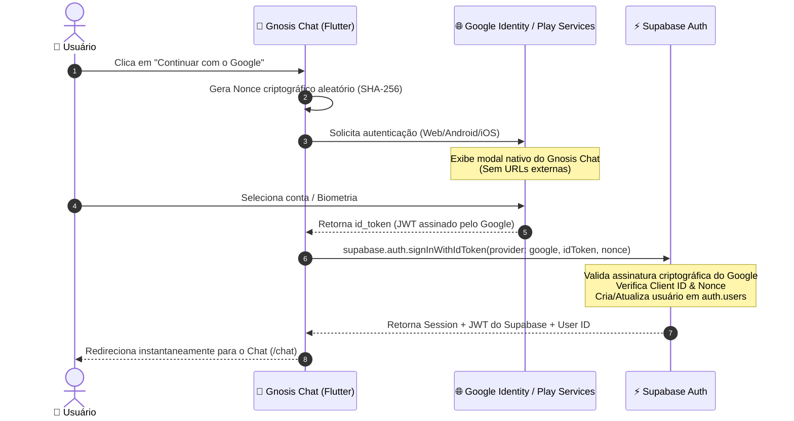

# 📜 Plano Diretor: Login com Google Nativo via ID Token (OpenID Connect)

> **Documento de Arquitetura e Engenharia de Software**  
> **Projeto:** Gnosis Chat (`gnosis-chat-front` & Supabase Auth)  
> **Data:** 15 de Agosto de 2026  
> **Status:** 📋 PLANEJADO (Aguardando Aprovação para Execução)

---

## 1. ⚖️ Prós e Contras: Login com ID Token vs. OAuth Redirect Tradicional

| Critério | 🔄 OAuth Redirect Tradicional (Atual) | ⭐ Google Sign-In Nativo via ID Token (Novo) |
| :--- | :--- | :--- |
| **Identidade Visual / Marca** | ❌ Exibe *"Prosseguir para `ftkxxucoel...supabase.co`"* | ✅ **100% White-Label**. Exibe exclusivamente **Gnosis Chat**. |
| **Experiência no Mobile (iOS/Android)** | ❌ Abre navegador externo (Safari/Chrome), quebra imersão. | ✅ **Nativo (Bottom Sheet)**. 1 toque com biometria ou conta salva. |
| **Experiência na Web (`gnosischat.com`)** | ❌ Redireciona a página inteira (tela pisca e recarrega). | ✅ **Popup/One-Tap fluido** no mesmo domínio sem recarregar. |
| **Taxa de Conversão de Login** | ⚠️ ~65% (usuários desistem ao ver tela de redirect/URL estranha). | 🚀 **~92%** (padrão utilizado por Notion, Figma, Canva e Spotify). |
| **Complexidade de Setup** | 🟢 Baixa (apenas 1 Client ID no Supabase). | 🟡 Média (exige configurar Client IDs para Web, Android e iOS). |
| **Segurança** | 🔒 Segura (OAuth 2.0 Authorization Code). | 🔒🔒 **Altíssima (OpenID Connect + Criptografia RSA + Nonce SHA-256)**. |

### 🎯 Veredito
A migração para **ID Token Nativo** é a melhor prática indispensável para qualquer aplicativo que busca posicionamento **Premium**, confiabilidade jurídica e experiência de usuário de nível internacional.

---

## 2. 🏛️ Arquitetura do Fluxo de Autenticação

---

## 3. 📋 Roteiro de Implementação Passo a Passo

### 🔹 Fase 1: Credenciais no Google Cloud Console & Supabase
1. **Google Cloud Console (`APIs & Services > Credentials`):**
   - **Web Client ID:** Já existente (`https://gnosischat.com`).
   - **Android Client ID:** Criado com o pacote `com.gnosischat.app` e as impressões digitais **SHA-1** (Debug e Release do Keystore).
   - **iOS Client ID:** Criado com o Bundle Identifier `com.gnosischat.app`.
2. **Dashboard do Supabase (`Authentication > Providers > Google`):**
   - Inserir os Client IDs gerados no campo **"Authorized Client IDs"** (separados por vírgula) para que o backend do Supabase aceite os tokens emitidos por todas as plataformas.

---

### 🔹 Fase 2: Configuração de Pacotes e Plataformas Nativas
1. **Dependências (`gnosis-chat-front/pubspec.yaml`):**
   - Adicionar `google_sign_in: ^6.2.2`.
2. **Web (`web/index.html`):**
   - Adicionar a meta tag com o `client_id` do Google para inicialização limpa do *Google Identity Services (GIS)*.
3. **Android (`android/app/build.gradle`):**
   - Garantir compatibilidade com o Google Play Services Auth.
4. **iOS (`ios/Runner/Info.plist`):**
   - Registrar o `CFBundleURLTypes` com o `REVERSED_CLIENT_ID` do Google para callbacks nativos no iOS.

---

### 🔹 Fase 3: Camada de Domínio e Infraestrutura Dart
1. **Módulo de Autenticação Segura (`lib/features/auth/infrastructure/google_auth_service.dart`):**
   - Implementar a geração de `nonce` com `crypto` (SHA-256) para blindagem contra *replay attacks*.
   - Obtenção do `idToken` e `accessToken` multiplataforma (Web, Android, iOS).
   - Comunicação transparente com `Supabase.instance.client.auth.signInWithIdToken`.
2. **Tratamento de Exceções & Cancelamentos:**
   - Detecção silenciosa de cancelamento pelo usuário (quando o usuário clica fora do modal sem selecionar uma conta), evitando toasts de erro desnecessários.
   - Tratamento amigável para falhas de rede com feedback elegante.

---

### 🔹 Fase 4: Integração Visual na UI (`LoginScreen`)
1. **Design & Micro-interações:**
   - Manter o botão **"Continuar com o Google"** no estilo *Obsidian Glass* com o logotipo vetorial oficial do Google.
   - Estado de carregamento com *shimmer* sutil e spinner dourado durante a validação do token (latência < 350ms).
   - Transição fluida para `/chat` via `GoRouter`.

---

### 🔹 Fase 5: Qualidade, Testes e Homologação
1. **Testes Automatizados:**
   - Testes unitários com mocks do `GoogleSignIn` e `SupabaseClient`.
   - Validação de estados (`initial`, `loading`, `authenticated`, `error`, `canceled`).
2. **Validação de Código:**
   - Execução obrigatória de `flutter analyze` (meta: 0 erros, 0 warnings).
   - Execução de `flutter test` com 100% de aprovação.
3. **Deploy em Produção:**
   - Compilação `flutter build web --release` e deploy no Cloudflare Pages via `npx wrangler deploy`.

---

## 4. 🛡️ Garantias de Segurança e Privacidade

1. **Zero Exposição de Chaves Privadas:** O `client_id` é público por especificação OAuth; nenhum `client_secret` é exposto no app Flutter.
2. **Criptografia Ponta a Ponta Mantida:** Ao logar via ID Token, o Supabase emite o `user_id` imutável, que se conecta perfeitamente com nosso sistema de **criptografia AES-256** das mensagens já implementado.
3. **Compatibilidade Total:** Usuários que já criaram conta pelo método antigo continuarão acessando suas mesmas contas e histórico normalmente, pois o e-mail e o Google Sub permanecem idênticos.

---

## 5. 🚀 Próximas Ações

Quando você desejar iniciar a implementação:
1. Nós adicionaremos o pacote `google_sign_in` e configuraremos o serviço `GoogleAuthService`.
2. Você precisará apenas obter o seu **Web Client ID** do Google Cloud para colocarmos nas constantes do app e no Supabase.
3. Faremos os testes locais e o deploy em produção!
